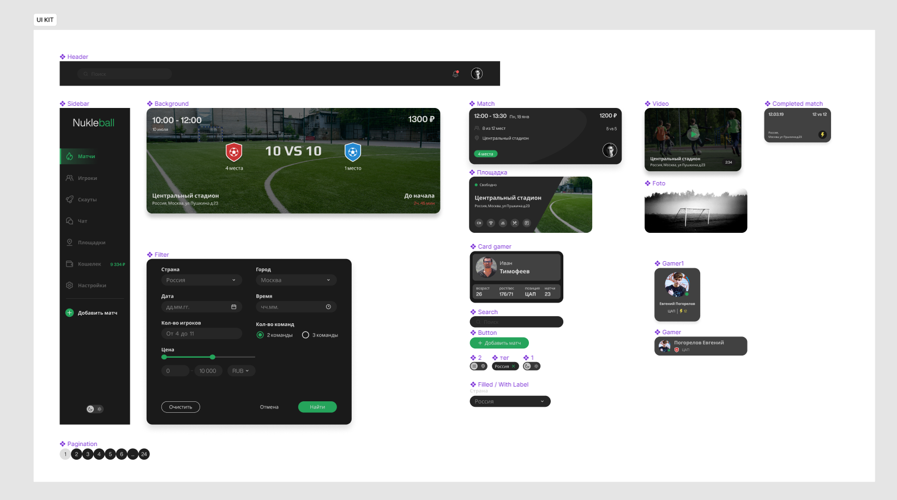
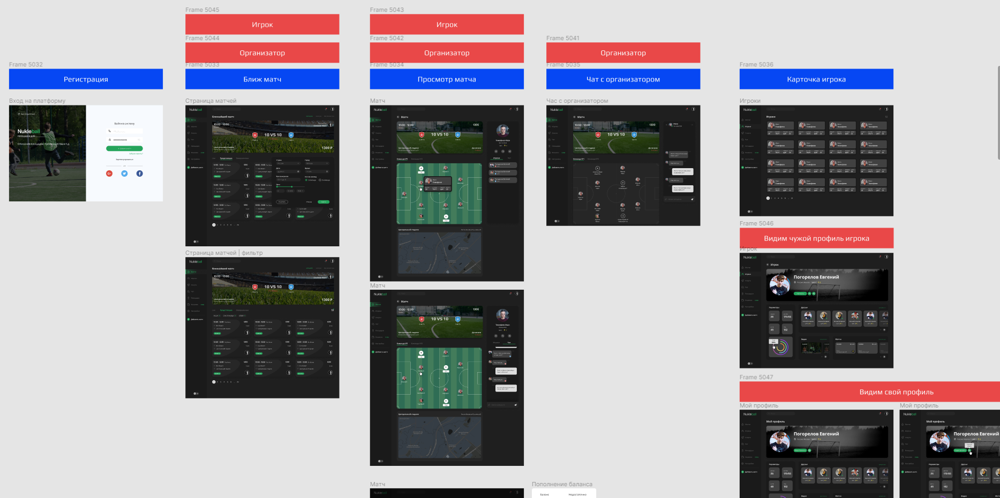

# NukleBall
The NukleBall service is designed to quickly and efficiently connect teams and academies with athletes in professional and amateur sports.

## Task
+ Develop design prototypes in Figma
+ UI KIT

## Process
During the prototyping process, I worked closely with a customer from Kazakhstan. I was looking for project references, working on usability, conducting surveys on respondents.

[See demo](https://andreiextr.github.io/NukleBall/)
